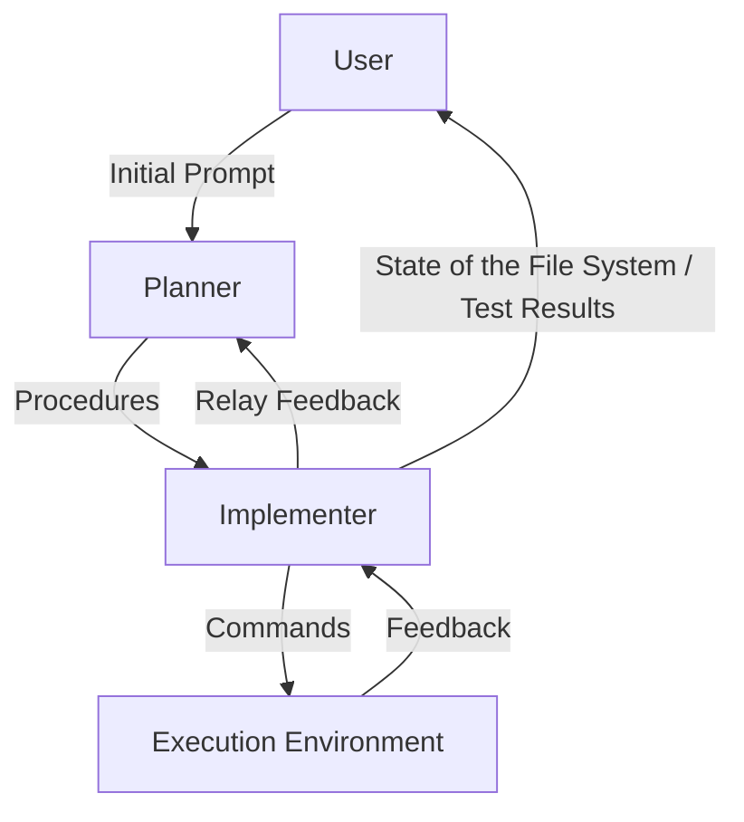
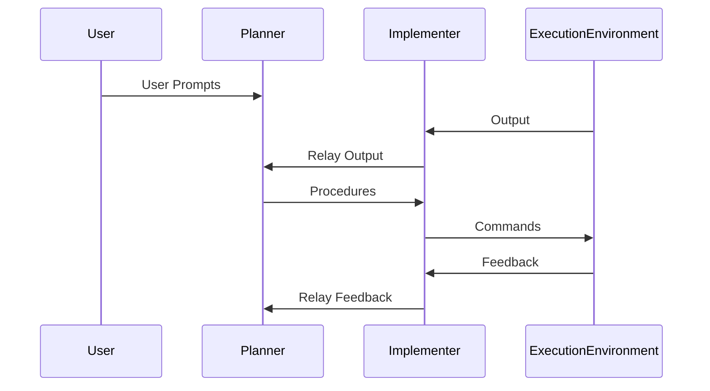

# GPT filesystem interface for AI App Builder
---
creation date:		2023-04-04 17:20
modification date:	2023-04-04 20:02
title: 				AI App Builder
tags: #engineering
---

## Background
The purpose of this project is to take advantage of Large Language Models to create a completely autonomous software development tool using GPT-4. The tool should be able to generate specifications, project configurations, tests, and code based on user inputs, and then execute the tests to ensure the generated code is correct. An intermediate step in this project is to tighten the feedback loop of AI driven software development by providing an interface that facilitates something closer to direct filesystem access. This will remove the need to copy and paste code and commands. Instead GPT interfaces with itself to generate commands that can be executed to implement its own suggestions. 

In my interactions with GPT 3.5 I found that the system was capable of generating high-level specifications, config files. Generating code based on these specifications de-bugging code based on output.

It has been shown that prompts can be engineered to format output according to a template or even using domain specific languages either existing or generated for the purpose. This capability suggest it should be possible to use GPT to parse it's own output and generate sequences of commands that can implement its suggestions. 

I hypothesize that GPT could perform all of the functions of software development without human interference if a script were able to:
* Interpret GPT's output and operate on the state of an execution environment
* pipe the output resulting from execution back into GPT which would then make suggestions for iteration

I envision that when this system is completed, it's user will be able to provide GPT with a high-level prompt and GPT will generate a specification, that it will then use to generate project configurations and tests that it can then use to generate code.

For the initial prototype I intend to focus on backend rest apis written using typescript and with a local sql database.

To ensure the quality and correctness of the code generated by the system, I intend to have the system start out by generating a specification that will be approved by the user. Then the system will generate project configurations that included the configurations for setting up a test environment. The project will then generate tests for each module to guide the implementation of the application code. As the systems writes code it will also execute tests of that code.

The acceptance criteria for a functioning application consists of the following:
* All of the modules in the approved specification have been implemented
* Full test coverage
* All of the tests are passing

Before developing an application that can generate applications. It is first necessary to create an interface that allows GPT to interact directly with an execution environment.

## Theoretical Arrangement of Interacting Modules
In our theoretical arrangement, we have a **planner**, an **implementer**, and an **execution environment**. 

The planner takes input from 2 sources:
1. User prompts
2. Output from the execution environment relayed from the implementer

The planner outputs procedures to implement the user's prompt. 

The implementer takes input from two sources.
1. Output from the planner
2. Feedback from the execution environment

When the implementer receives a procedure from the planner. It interprets the output and generates specific commands for interacting with the execution environment. 

When the implementer receives feedback from the execution environment it relay's the feedback to the planner which then makes further suggestions. It can also provide updates to the user regarding the state  of the filesystem and commands that have been executed





## On the phases of operation
The function of the planner in the production of the application can be summarized in 4 phases:

1. Generation of the specification: Facilitate prompt engineering through iterative refinement. This step can include the user in the feedback loop. This phase will take the user from a high-level spec to a specific description of a rest api. This step can be accelerated responses kept uniform if we provide a template and instruct GPT to format its response accordingly. We can then parse the specification and store it in a data-structure for future prompts.

2. Generate project configurations these will include:
	* tsconfig.json
	* db schema
	* package.json
	* testing configurations

3. Generate tests for each module:
```
for each module in the specification:
	planner generates a tests for that module
	implementer generates commands for writing tests
	implementer generates commands for running tests
	execution enviroment runs commands generated by implementer
	while there are errors returned from the execution environment and threshold for attempts is not met:
		the implementer assembles a context to pass to the planner for debugging
		the planner generates suggestions based on the context from the implementer
		implementer parses suggestions and generates commands for the execution environment
		the commands are run in the execution environment and feedback is returned
	if (there are errors)
		alert the user that they will need to debug the module
		break execution but maintain a reference to the module we are generating tests for 
```

4. Generate application code for each module
```
for each module in the specification:
	planner generates a application code for that module to satisfy the tests of the previous step
	implementer generates commands for writing application code
	execution enviroment runs commands generated by implementer
	while there are errors returned from the execution environment or test cases are not passing and threshold for attempts is not met:
		the implementer assembles a context to pass to the planner for debugging
		the planner generates suggestions based on the context from the implementer
		implementer parses suggestions and generates commands for the execution environment
		the commands are run in the execution environment and feedback is returned
	if (there are errors)
		alert the user that they will need to debug the module
		break execution but maintain a reference to the module we are generating tests for 
```

## On the Implementer and the Planner
The planner and implementer modules will both leverage the GPT-4 API. The planner and implementer modules will provide templates in their GPT-4 prompts that cause data to be returned in a manner that allows it to be easily parsed by other modules in the application.

## Roadmap
* Implement a utility using the proposed methodology that interfaces with the GPT API and the local filesystem. 
* The utility will include a frontend web interface that runs locally.

## User Work flow
1. User enters a description of the api and it's functionality
2. User submits the description to the endpoint `generate_specification`
3. The planner service interacts with GPT-4 to get a specification documenting required API endpoints; their parameters, request objects and response objects
4. The specification is returned and displayed to the user on the frontend
5. If the user approves the specification, `/configure_project` endpoint is called. This will carry out the activities described in phase 2
6. When the project is configured, the api triggers the next phase `generateTests`
7. When the tests are generated, the api triggers the next phase `generateApplicationCode`

## On Experimentation
In order to determine the most effective templates to facilitate this project. I propose the use of an experimental workflow that will allow us to step through this process manually. The feedback loop will be tighter than if a user were just interacting with chatGPT. But will give the user control at every iteration of the feedback loop. Unlike what we intend in the final product. This will allow us to determine the effectiveness of individual interactions and make adjustments to our engineering prompts, and the algorithms that parse the results.

## On the generation of code and configs
The implementer should make use of git version control. That way, if there is an issue at any step that requires user intervention. We don't damage the working state of the codebase. A good convention is, for any set of command submitted to the execution environment, create a new branch. When the commands are completed and the working state verified, merge that branch into its parent.

It makes sense to use a design pattern that can guide the generation of specifications, configurations, and code. For the time being, we will make sure the specification breaks down the following:
* ERD
* Models
* Routes
* Services
* Repositories

We can specify the use of specific tools to achieve the end we've laid out. I think it makes sense to provide these constraints up front. The technical stack will consist of the following:

## On the execution environment
In the first iterations, the execution environment can be the local environment, in future iterations, we can facilitate connections to other environments via ssh.

## On the UI
The first iteration should loop the user in at every step. I propose an interface that allows the user to see some of  the steps in reasoning. There will be 4 panes:
* Prompt: Editable display of user prompt
* Planner: Display the result of the prompt
* Implementer: Display the result of processing the planner output into executable commands
* Environment: Displays the filesystem and output of the execution environment

In this phase, the user manually reviews output at each phase and approves generated commands for execution. If there is any unfavorable output, the user can modify the prompt and/or adjust the manner in which executable commands are generated. 
